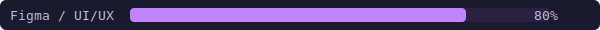
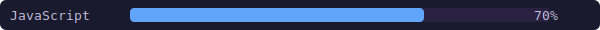

<!-- Header -->

---

 

 

&nbsp;

 

## 🚧 Currently building

| Project | Description | Stack |
|---|---|---|
| **[Gavel](https://github.com/AlexanderLislelid/semester-project-2)** | Auction house web app | Vanilla JS · Tailwind v4 · Noroff v2 API |

## 🌱 Currently learning

- Front-end architecture & code organisation
- Scalable vanilla JS patterns
- Accessibility (a11y) best practices

## 🤝 Open to

- Beginner-friendly open-source collaboration
- Feedback on projects and code quality

## 📫 Contact

---

<!-- Footer -->

